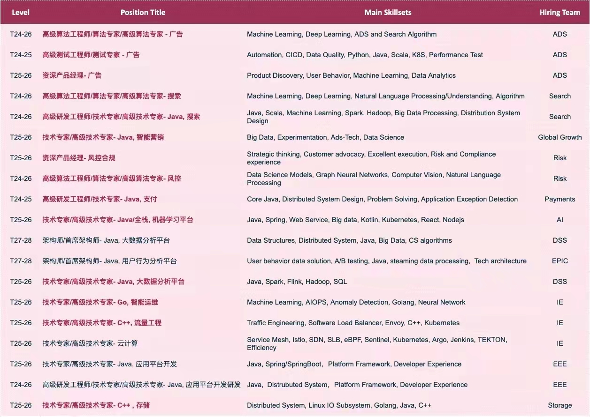

# 职位：研发、算法
工作地点：上海，德国中心（张江高科地铁站附近）

# 招聘职位列表

职位具体要求可以关注 "eBay技术荟" 公众号具体查看，或者打开[链接](https://ebay.tupu360.com/position/list?enter=menu&lang=zh_CN&type=SOCIALRECRUITMENT&state=82a546684d0906a5b6d1692d311e25c6&code=031eBi000NP9zN1yic000uMxQT3eBi00&_t=1648623050819)
扫码二维码查看具体职位。这样你可以对具体职位有一定的了解。

## 职位解释

招聘level: T24对标p6，T25对标p7；T24工作要求2-3年以上，T25一般是5年经验左右或以上。

目前热招职位：ADS（广告平台：需要算法、工程），SEARCH（搜索平台：算法和工程），AI platform（AI平台：需要工程or算法）

PM职位较少，一般都是需要有platform相关经验的资深候选人。

## 公司福利 or 待遇

1. 薪资待遇：薪资+股票（总包）不输于同级别的国内互联网大厂
2. 工作时间：正常外企工作时间，965or1065这样的，无特殊情况不加班；如果真的有加班（比如周六，节假日），会按照对应标准给加班费or调休（比如周末加班就是双倍工资or2天正常年假）；我在这里没遇见过这种加班。
3. 假期待遇：起步15天，基本是很多互联网大厂的最高年假标准了；病假等等都是有的，不详细说。
4. 年会：每年奖品比较丰厚，去年最差的是3500左右水准的奖品，并且人人都有。
5. 全员持股（股票购买计划）：按照你工资税前收入10%低价（8.5折）买入公司股票。（也就是你直接卖出盈利15%）

其他隐形有点：

1. 同事和老板关系融洽，任何合理的事情大家都可以交流，非工作的事情大家也可以交流，不会孤单。
2. 老板会定期和你one one（一般一个月），和沟通工作or非工作的事情；并且在新的事情or项目启动的时候，老板会先于你考虑一些事情并主动提供给你帮助。
东西太多了，一时想不起来了。

## 技术成长

eBay国内的技术团队实力都非常不错,技术栈不封闭,不会说你在这里掌握or学习的东西出去一点用的没有。比如我们团队是做数据平台的，会用并参与开发一些开源项目，团队中有非常多的同事是Apache一些大数据项目的PMC or Committer（比如Sarpk，Kylin，Hadoop，Arrow，Kyuubi等）。

# 内推联系方式

email: 
公司邮箱：kliu3 at ebay.com
个人邮箱：liukun at apache.org

有什么需求，可以直接发送邮件给我，职位具体内容等等可以邮件或者微信沟通。
