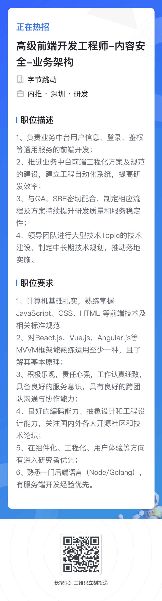
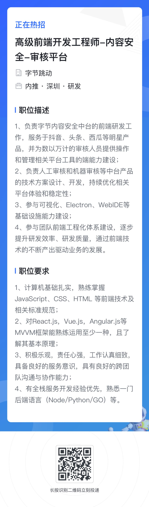
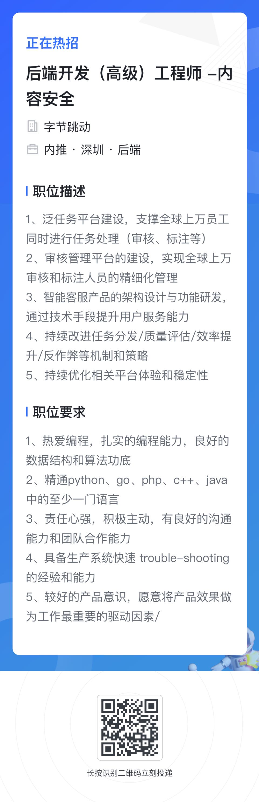
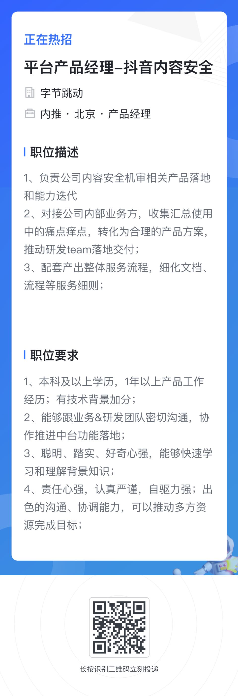

# 部门&业务介绍
字节跳动旨在创造全球创作与交流平台，旗下包括抖音、今日头条、西瓜等多款产品。在实现这一愿景的征程中，内容中台为字节跳动的所有产品提供内容安全与内容理解的通用能力，是业务发展的生命线，也为业务增长源源不断提供动力。
基于人工智能的内容处理中台的建设，日处理上亿条内容，全体裁(图文、音视频等)/业务(头条、抖音、TikTok等)/国家覆盖;接入数百个 Al审核模型，并提供相关的数据集和流程机制。
内容安全业务体量大，是全公司日活最高的B端平台之一。我们需要在保证业务的同时，夯实基础，建立规范。探索最极致的技术、保证7*24系统稳定。对技术精益求精，较强的时间管理能力，全面的系统性视野，我们极度渴望优秀的你一起加入，去打造行业标杆，为内容安全保驾护航。

# 招聘岗位&城市
目前前、后端，产品、运营同学在 北京、深圳 两地还有大量 hc

# 联系方式

邮箱：xiezhiqiang@bytedance.com

微信：xiezhiqiang1

github：https://github.com/huruji

# 具体 JD

### 业务架构

### 前端

### 后端

### 产运

